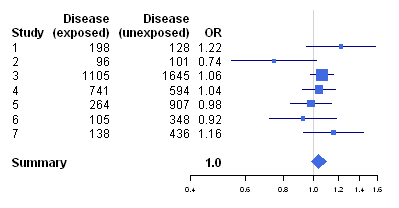
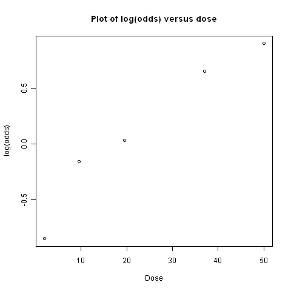

A Little Book of R for Biomedical Statistics 
============================================

Biomedical statistics
---------------------

This booklet tells you how to use the R software to carry out some simple analyses
that are common in biomedical statistics. In particular, the focus is on cohort
and case-control studies that aim to test whether particular factors are
associated with disease, randomised trials, and meta-analysis.

Introduction to R
-----------------

This little booklet has some information on how to use R for biomedical statistics.

R (`www.r-project.org <http://www.r-project.org/>`_) is a commonly used
free Statistics software. R allows you to carry out statistical
analyses in an interactive mode, as well as allowing simple programming.

How to check if R is installed on a Windows PC
----------------------------------------------

To use R, you first need to install the R program on your computer.

These instructions are for installing R on a Windows PC.

Before you install R on your computer, the first thing to do is to check whether
R is already installed on your computer (for example, by a previous user). To do this,
click on the "Start" menu at the bottom left of your Windows desktop, and then move your 
mouse over "All Programs" in the menu that pops up. See if "R" appears in the list
of programs that pops up. If it does, it means that R is already installed on your
computer, and you can start R by selecting "R"  (or R X.X.X, where X.X.X gives the version of R, 
eg. R 2.10.0) from the list.

|image1|

If there is an old version of R installed on the Windows PC that you are using,
it is worth installing the latest version of R, to make sure that you have all the
latest R functions available to you to use.

Installing R on a Windows PC
----------------------------

To install R on your Windows computer, follow these steps:

1. Go to `http://ftp.heanet.ie/mirrors/cran.r-project.org <http://ftp.heanet.ie/mirrors/cran.r-project.org>`_.
2. Under "Download and Install R", click on the "Windows" link.
3. Under "Subdirectories", click on the "base" link.
4. On the next page, you should see a link saying something like "Download R 2.10.1 for Windows" (or R X.X.X, where X.X.X gives the version of R, eg. R 2.11.1). 
   Click on this link.
5. You may be asked if you want to save or run a file "R-2.10.1-win32.exe". Choose "Save" and
   save the file on the Desktop. Then double-click on the icon for the file to run it.
6. You will be asked what language to install it in - choose English.
7. The R Setup Wizard will appear in a window. Click "Next" at the bottom of the R Setup wizard 
   window.
8. The next page says "Information" at the top. Click "Next" again.
9. The next page says "Information" at the top. Click "Next" again.
10. The next page says "Select Destination Location" at the top. 
    By default, it will suggest to install R in "C:\\Program Files" on your computer. 
11. Click "Next" at the bottom of the R Setup wizard window.
12. The next page says "Select components" at the top. Click "Next" again.
13. The next page says "Startup options" at the top. Click "Next" again.
14. The next page says "Select start menu folder" at the top. Click "Next" again.
15. The next page says "Select additional tasks" at the top. Click "Next" again.
16. R should now be installed. This will take about a minute. When R has finished, you will 
    see "Completing the R for Windows Setup Wizard" appear. Click "Finish".
17. If you click on the "Start" button at the bottom left of your computer screen, and then 
    choose "All programs", you can start R by selecting "R"  (or R X.X.X, where 
    X.X.X gives the version of R, eg. R 2.10.0) from the menu of programs. 
    The R console (a rectangle) should pop up:

|image3|

How to install an R library
---------------------------

R comes with some standard libraries that are installed when you install R. However, in this 
booklet I will also tell you how to use some additional R libraries that are useful, for example,
the "rmeta" library. These additional libraries do not come with the standard installation of R,
so you need to install them yourself.

Once you have installed R on a Windows computer (following the steps above), you can install 
an additional library by following the steps below:

1. Start R by clicking on the "Start" button at the bottom left of your computer screen, 
   choosing "All programs", and starting R by selecting "R" (or R X.X.X, where
   X.X.X gives the version of R, eg. R 2.10.0) from the menu of programs. 
   The R console (a rectangle) should pop up.
2. Once you have started R, you can now install an R library (eg. the "rmeta" library) by 
   using the install.packages() R function. For example, to install the "rmeta" library, type in
   the R console:

::

    > install.packages("rmeta")

3. This will ask you what website you want to download the package from, you should choose 
   "Ireland" (or another country, if you prefer). This will install the "rmeta" package.
4. The "rmeta" package is now installed. Whenever you want to use the "rmeta" package after this, 
   after starting R, you first have to load the package by typing into the R console:

::

    > library("rmeta")

Running R
-----------

To use R, you first need to start the R program on your computer.
You should have already installed R on your computer (see above). 
To start R, click on the "Start" menu at the bottom left of your
Windows desktop, and then move your mouse over "All Programs" in
the menu that pops up, and then click on 'R' (or R X.X.X, where
X.X.X gives the version of R, eg. R 2.10.0) in the list of programs
that pops up. This should bring up a new window, which is the
*R console*.

A brief introduction to R
-------------------------

You will type R commands into the R console in order to carry out
analyses in R. In the R console you will see:

.. highlight:: r

::

    >

This is the R prompt. We type the commands needed for a particular
task after this prompt. The command is carried out after you hit
the Return key.

Once you have started R, you can start typing in commands, and the
results will be calculated immediately, for example:

::

    > 2*3
    [1] 6
    > 10-3
    [1] 7

All variables (scalars, vectors, matrices, etc.) created by R are
called *objects*. In R, we assign values to variables using an
arrow. For example, we can assign the value 2\*3 to the variable
*x* using the command:

::

    > x <- 2*3 

To view the contents of any R object, just type its name, and the
contents of that R object will be displayed:

::

    > x
    [1] 6

There are several possible different types of objects in R,
including scalars, vectors, matrices, arrays, data frames, tables,
and lists. The scalar variable *x* above is one example of an R
object. While a scalar variable such as *x* has just one element, a
vector consists of several elements. The elements in a vector are
all of the same type (eg. numeric or characters), while lists may
include elements such as characters as well as numeric quantities.

To create a vector, we can use the c() (combine) function. For
example, to create a vector called *myvector* that has elements
with values 8, 6, 9, 10, and 5, we type:

::

    > myvector <- c(8, 6, 9, 10, 5)

To see the contents of the variable *myvector*, we can just type
its name:

::

    > myvector
    [1]  8  6  9 10  5

The [1] is the index of the first element in the vector. We can
extract any element of the vector by typing the vector name with
the index of that element given in square brackets. For example, to
get the value of the 4th element in the vector *myvector*, we
type:

::

    > myvector[4]
    [1] 10

In contrast to a vector, a list can contain elements of different
types, for example, both numeric and character elements. A list can
also include other variables such as a vector. The list() function
is used to create a list. For example, we could create a list
*mylist* by typing:

::

    > mylist <- list(name="Fred", wife="Mary", myvector)

We can then print out the contents of the list *mylist* by typing
its name:

::

    > mylist
    $name
    [1] "Fred"
    
    $wife
    [1] "Mary"
    
    [[3]]
    [1]  8  6  9 10  5

The elements in a list are numbered, and can be referred to using
indices. We can extract an element of a list by typing the list
name with the index of the element given in double square brackets
(in contrast to a vector, where we only use single square
brackets). Thus, we can extract the second and third elements from
*mylist* by typing:

::

    > mylist[[2]]
    [1] "Mary"
    > mylist[[3]]
    [1]  8  6  9 10  5

Elements of lists may also be named, and in this case the elements
may be referred to by giving the list name, followed by "$",
followed by the element name. For example, *mylist$name* is the
same as *mylist[[1]]* and *mylist$wife* is the same as
*mylist[[2]]*:

::

    > mylist$wife
    [1] "Mary"

We can find out the names of the named elements in a list by using
the attributes() function, for example:

::

    > attributes(mylist)
    $names
    [1] "name" "wife" ""    

When you use the attributes() function to find the named elements
of a list variable, the named elements are always listed under a
heading "$names". Therefore, we see that the named elements of the
list variable *mylist* are called "name" and "wife", and we can
retrieve their values by typing *mylist$name* and *mylist$wife*,
respectively.

Another type of object that you will encounter in R is a *table*
variable. For example, if we made a vector variable *mynames*
containing the names of children in a class, we can use the table()
function to produce a table variable that contains the number of
children with each possible name:

::

    > mynames <- c("Mary", "John", "Ann", "Sinead", "Joe", "Mary", "Jim", "John", "Simon")
    > table(mynames)
    mynames
       Ann    Jim    Joe   John   Mary  Simon Sinead 
         1      1      1      2      2      1      1 

We can store the table variable produced by the function table(),
and call the stored table "mytable", by typing:

::

    > mytable <- table(mynames)

To access elements in a table variable, you need to use double
square brackets, just like accessing elements in a list. For
example, to access the fourth element in the table *mytable* (the
number of children called "John"), we type:

::

    > mytable[[4]]
    [1] 2

Alternatively, you can use the name of the fourth element in
the table ("John") to find the value of that table element:

::

    > mytable[["John"]]
    [1] 2

Functions in R usually require *arguments*, which are input
variables (ie. objects) that are passed to them, which they then
carry out some operation on. For example, the log10() function is
passed a number, and it then calculates the log to the base 10 of
that number:

::

    > log10(100)
    2

In R, you can get help about a particular function by using the
help() function. For example, if you want help about the log10()
function, you can type:

::

    > help("log10")

When you use the help() function, a box or webpage will pop up with
information about the function that you asked for help with.

If you are not sure of the name of a function, but think you know
part of its name, you can search for the function name using the
help.search() function. For example, if you want to know if there
is a function to calculate the standard deviation of a set of
numbers, you can search for the names of all functions containing
the word "deviation" in their description by typing:

::

    > help.search("deviation")
    Help files with alias or concept or title matching
    'deviation' using fuzzy matching:
    
    genefilter::rowSds
                        Row variance and standard deviation of
                        a numeric array
    nlme::pooledSD      Extract Pooled Standard Deviation
    stats::mad          Median Absolute Deviation
    stats::sd           Standard Deviation
    vsn::meanSdPlot     Plot row standard deviations versus row

Among the functions that were found, is the function sd() in the
"stats" library (an R library that comes with the standard R
installation), which is used for calculating the standard deviation.

We can perform computations with R using objects such as scalars
and vectors. For example, to calculate the average of the values in
the vector *myvector* (ie. the average of 8, 6, 9, 10 and 5), we
can use the mean() function:

::

    > mean(myvector)
    [1] 7.6

We have been using built-in R functions such as mean(),
length(), print(), plot(), etc. We can also create our own
functions in R to do calculations that you want to carry out very
often on different input data sets. For example, we can create a
function to calculate the value of 20 plus square of some input
number:

::

    > myfunction <- function(x) { return(20 + (x*x)) }

This function will calculate the square of a number (*x*), and then
add 20 to that value. The return() statement returns the calculated
value. Once you have typed in this function, the function is then
available for use. For example, we can use the function for
different input numbers (eg. 10, 25):

::

    > myfunction(10)
    [1] 120
    > myfunction(25) 
    [1] 645

To quit R, type:

::

    > q()

Calculating Relative Risks for a Cohort Study
---------------------------------------------

One very common type of data set in biomedical statistics is a cohort study, where you have
information on people who were exposed to some treatment or environment (for example, people
who took a certain drug, or people who smoke) and also on whether the same people have a 
particular disease or not. Your data set would look something like this:

+------------+------------+-----------+
|            | Disease    | Control   |  
+============+============+===========+
| Exposed    | 156        | 9421      |
+------------+------------+-----------+
| Unexposed  | 1531       | 14797     |
+------------+------------+-----------+

You can enter the data in R by typing:

::

    > mymatrix <- matrix(c(156,9421,1531,14797),nrow=2,byrow=TRUE)
    > colnames(mymatrix) <- c("Disease","Control")
    > rownames(mymatrix) <- c("Exposed","Unexposed")
    > print(mymatrix)
               Disease Control
    Exposed       156    9421
    Unexposed    1531   14797
    
You can calculate the relative risk of having the disease given exposure in R, by using a
function calcRelativeRisk(). To be able to use this function, just copy the following code and paste
it into R:

::

    > calcRelativeRisk <- function(mymatrix,alpha=0.05,referencerow=2)
      {
         numrow <- nrow(mymatrix) 
         myrownames <- rownames(mymatrix)
         for (i in 1:numrow)
      	 {
    	    rowname <- myrownames[i]
            DiseaseUnexposed <- mymatrix[referencerow,1]
            ControlUnexposed <- mymatrix[referencerow,2]
    	    if (i != referencerow)
	    {
	       DiseaseExposed <- mymatrix[i,1]
	       ControlExposed <- mymatrix[i,2]
	       totExposed <- DiseaseExposed + ControlExposed
	       totUnexposed <- DiseaseUnexposed + ControlUnexposed
	       probDiseaseGivenExposed <- DiseaseExposed/totExposed
	       probDiseaseGivenUnexposed <- DiseaseUnexposed/totUnexposed
		
               # calculate the relative risk 
	       relativeRisk <- probDiseaseGivenExposed/probDiseaseGivenUnexposed
	       print(paste("category =", rowname, ", relative risk = ",relativeRisk))
			
	       # calculate a confidence interval
	       confidenceLevel <- (1 - alpha)*100
	       sigma <- sqrt((1/DiseaseExposed) - (1/totExposed) + (1/DiseaseUnexposed) - (1/totUnexposed)) 
	       # sigma is the standard error of estimate of log of relative risk
	       z <- qnorm(1-(alpha/2))         
	       lowervalue <- relativeRisk * exp(-z * sigma)
	       uppervalue <- relativeRisk * exp( z * sigma)
	       print(paste("category =", rowname, ", ", confidenceLevel,"% confidence interval = [",lowervalue,",",uppervalue,"]"))	
	    }
         }
      }

You can now use the function calcRelativeRisk() to calculate the relative risk of having the
disease given exposure, and a confidence interval for that relative risk. For example, to
calculate a 99% confidence interval, type:

::

    > calcRelativeRisk(mymatrix,alpha=0.01)
   [1] "category = Exposed , relative risk =  0.173721236521721"
   [1] "category = Exposed ,  99 % confidence interval = [ 0.140263410926649 , 0.215159946697844 ]"

This tells you that the estimate of the relative risk is about 0.174, and that a 99% confidence interval is [0.140, 0.215].
A relative risk of 0.174 means that the risk of disease in people who are exposed (to the treatment or environmental
factor etc. that we are examining) is 0.174 times the risk of disease of people who are not exposed. 

If the relative risk is 1 (ie. if the confidence interval includes 1), it means there is no evidence for an association between exposure and disease.
Otherwise, if the relative risk > 1, there is evidence of a positive association between exposure and disease; while
if the relative risk < 1, there is evidence of a negative association. The relative risk can be estimated for a
cohort study but not for a case-control study.

Note that we can also use the calcRelativeRisk() function in the case where we have more than
one exposure category (eg. smoking cigarettes versus smoking cigars, compared to non-smoking).
For this purpose it is used similarly to the calcOddsRatio() function (see below).

Calculating Odds Ratios for a Cohort or Case-Control Study
----------------------------------------------------------

As well as the relative risk of disease given exposure (to some treatment or environmental factor eg. smoking or some drug),
you can also calculate the odds ratio for association between the exposure and the disease
in a cohort study. The odds ratio is also commonly calculated in a case-control
study. Again, for either a cohort study or case-control study, your data will look something like this:

Your data set would look something like this:

+------------+------------+-----------+
|            | Disease    | Control   |  
+============+============+===========+
| Exposed    | 156        | 9421      |
+------------+------------+-----------+
| Unexposed  | 1531       | 14797     |
+------------+------------+-----------+

You can enter the data in R by typing:

::

    > mymatrix <- matrix(c(156,9421,1531,14797),nrow=2,byrow=TRUE)
    > colnames(mymatrix) <- c("Disease","Control")
    > rownames(mymatrix) <- c("Exposed","Unexposed")
    > print(mymatrix)
               Disease Control
    Exposed       156    9421
    Unexposed    1531   14797

You can use the following R function, calcOddsRatio() to calculate the odds ratio for association between
the exposure and the disease. You will need to copy and paste the function into R before you can use it:

::

   > calcOddsRatio <- function(mymatrix,alpha=0.05,referencerow=2,quiet=FALSE)
   {
      numrow <- nrow(mymatrix) 
      myrownames <- rownames(mymatrix)
	
      for (i in 1:numrow)
      {
         rowname <- myrownames[i]
	 DiseaseUnexposed <- mymatrix[referencerow,1]
	 ControlUnexposed <- mymatrix[referencerow,2]
	 if (i != referencerow)
	 {
  	    DiseaseExposed <- mymatrix[i,1]
	    ControlExposed <- mymatrix[i,2]
			
   	    totExposed <- DiseaseExposed + ControlExposed
  	    totUnexposed <- DiseaseUnexposed + ControlUnexposed
			
	    probDiseaseGivenExposed <- DiseaseExposed/totExposed
	    probDiseaseGivenUnexposed <- DiseaseUnexposed/totUnexposed
	    probControlGivenExposed <- ControlExposed/totExposed
	    probControlGivenUnexposed <- ControlUnexposed/totUnexposed
	
            # calculate the odds ratio            
	    oddsRatio <- (probDiseaseGivenExposed*probControlGivenUnexposed)/(probControlGivenExposed*probDiseaseGivenUnexposed)
	    if (quiet == FALSE)
	    {
	       print(paste("category =", rowname, ", odds ratio = ",oddsRatio))
	    }
			
	    # calculate a confidence interval
	    confidenceLevel <- (1 - alpha)*100
	    sigma <- sqrt((1/DiseaseExposed)+(1/ControlExposed)+(1/DiseaseUnexposed)+(1/ControlUnexposed)) 
            # sigma is the standard error of our estimate of the log of the odds ratio
	    z <- qnorm(1-(alpha/2)) 
   	    lowervalue <- oddsRatio * exp(-z * sigma)
	    uppervalue <- oddsRatio * exp( z * sigma)
	    if (quiet == FALSE)
	    {
	       print(paste("category =", rowname, ", ", confidenceLevel,"% confidence interval = [",lowervalue,",",uppervalue,"]"))	
	    }
	 }
      }
      if (quiet == TRUE && numrow == 2) # If there are just two treatments (exposed/nonexposed)
      {
         return(oddsRatio)
      }
   } 

You can then use the function to calculate the odds ratio for association between the exposure
and the disease, and a confidence interval for the odds ratio.
For example, to calculate the odds ratio and a 95% confidence interval for the odds ratio:

::

   > calcOddsRatio(mymatrix,alpha=0.05)
   [1] "category = Exposed , odds ratio =  0.160039091621751"
   [1] "category = Exposed ,  95 % confidence interval = [ 0.135460641900536 , 0.189077140693912 ]"

This tells us that our estimate of the odds ratio is about 0.160, and a 95% confidence interval
for the odds ratio is [0.135, 0.189].

If the odds ratio is 1 (ie. if the confidence interval includes 1), it means there is no evidence for an association between exposure and disease.
Otherwise, if the odds ratio > 1, there is evidence of a positive association between exposure and disease; while
if the odds ratio < 1, there is evidence of a negative association. The odds ratio can be estimated for either a cohort
study or a case-control study.

We may also have several different exposures (for example, smoking cigarettes versus smoking cigars, compared to
no smoking). In that case, our data will look like this:

+------------+------------+-----------+
|            | Disease    | Control   |  
+============+============+===========+
| Exposure1  | 30         | 24        |
+------------+------------+-----------+
| Exposure2  | 76         | 241       |
+------------+------------+-----------+
| Unexposed  | 82         | 509       |
+------------+------------+-----------+

You can enter the data in R by typing (notice that you need to type "nrow=3" now to have 3 rows):

::

    > mymatrix <- matrix(c(30,24,76,241,82,509),nrow=3,byrow=TRUE)
    > colnames(mymatrix) <- c("Disease","Control")
    > rownames(mymatrix) <- c("Exposure1","Exposure2","Unexposed")
    > print(mymatrix)
               Disease Control
     Exposure1      30      24
     Exposure2      76     241
     Unexposed      82     509

We can again use the function calcOddsRatio() to calculate the odds ratio for each exposure category
relative to lack of exposure. We need to tell the calcOddsRatio() which row in our data matrix contains
the data for lack of exposure (row 3 here), by using the "referencerow=" argument:

::

    > calcOddsRatio(mymatrix, referencerow=3)
    [1] "category = Exposure1 , odds ratio =  7.75914634146342"
    [1] "category = Exposure1 ,  95 % confidence interval = [ 4.32163714854064 , 13.9309131884372 ]"
    [1] "category = Exposure2 , odds ratio =  1.95749418075094"
    [1] "category = Exposure2 ,  95 % confidence interval = [ 1.38263094540732 , 2.77137111707344 ]"

If your data comes from a cohort study (but not from a case-control study), you can also calculate
the relative risk for each exposure category:

::

   > calcRelativeRisk(mymatrix, referencerow=3)
   [1] "category = Exposure1 , relative risk =  4.00406504065041"
   [1] "category = Exposure1 ,  95 % confidence interval = [ 2.93130744422409 , 5.46941498113737 ]"
   [1] "category = Exposure2 , relative risk =  1.72793721628068"
   [1] "category = Exposure2 ,  95 % confidence interval = [ 1.30507489771431 , 2.2878127750653 ]"

Testing for an Association Between Disease and Exposure, in a Cohort or Case-Control Study
------------------------------------------------------------------------------------------

In a case-control or cohort study, it is interesting to do a statistical test for association
between having the disease and being exposed to some treatment or environment (for example,
smoking or taking a certain drug). 

In R, you can test for an association using the Chi-squared test, or Fisher's exact test.
For example, using our data from the example above:

::

   > print(mymatrix)
             Disease Control
   Exposure1      30      24
   Exposure2      76     241
   Unexposed      82     509
   > chisq.test(mymatrix)
        Pearson's Chi-squared test

    data:  mymatrix 
    X-squared = 60.5762, df = 2, p-value = 7.015e-14
   
   > fisher.test(mymatrix) 
       Fisher's Exact Test for Count Data

    data:  mymatrix 
    p-value = 5.263e-12
    alternative hypothesis: two.sided 
    
Here the P-value for the Chi-squared test is about 7e-14, and the P-value for Fisher's exact
test is about 5e-12. Both are very tiny (<0.05), indicating a significant association between
exposure and disease. 

Calculating the (Mantel-Haenszel) Odds Ratio when there is a Stratifying Variable 
---------------------------------------------------------------------------------

You may have data from a cohort study or case-control study that is stratified, for example,
the data may be separated (stratified) by the sex of the people studied. For example, we may
have two different tables giving information on the relationship between exposure (eg. to
a certain drug or smoking cigarettes) and having a particular disease. One of the tables
may given information for women, and the other give information for men.

Data for women:

+------------+------------+-----------+
|            | Disease    | Control   |  
+============+============+===========+
| Exposure   | 4          | 5         |
+------------+------------+-----------+
| Unexposed  | 5          | 103       |
+------------+------------+-----------+

Data for men:

+------------+------------+-----------+
|            | Disease    | Control   |  
+============+============+===========+
| Exposure   | 10         | 3         |
+------------+------------+-----------+
| Unexposed  | 5          | 43        |
+------------+------------+-----------+

We can enter our data into R as follows:

::

    > mymatrix1 <- matrix(c(4,5,5,103),nrow=2,byrow=TRUE)
    > colnames(mymatrix1) <- c("Disease","Control")
    > rownames(mymatrix1) <- c("Exposure","Unexposed")
    > print(mymatrix1)
              Disease Control
    Exposure        4       5
    Unexposed       5     103
    
    > mymatrix2 <- matrix(c(10,3,5,43),nrow=2,byrow=TRUE)
    > colnames(mymatrix2) <- c("Disease","Control")
    > rownames(mymatrix2) <- c("Exposure","Unexposed")
    > print(mymatrix2)
              Disease Control
    Exposure       10       3
    Unexposed       5      43

The Mantel-Haenszel odds ratio estimates the odds ratio for association between the exposure and disease, controlling
for the possible confounding effects of the stratifying variable (gender here). There is an R library
called "lawstat" that contains a function "cmh.test()" for calculating the Mantel-Haenszel odds ratio.
To use this function, we first need to install and load the "lawstat" R library by typing:

::

    > install.packages("lawstat")
    > library("lawstat")

You can then use the "cmh.test()" function to calculate the Mantel-Haenszel odds ratio:

::

    > myarray <- array(c(mymatrix1,mymatrix2),dim=c(2,2,2))
    > cmh.test(myarray)
        Cochran-Mantel-Haenszel Chi-square Test

      data:  myarray 
      CMH statistic = 40.512, df = 1.000, p-value = 0.000, 
      MH Estimate = 23.001, 
      Pooled Odd Ratio = 25.550, 
      Odd Ratio of level 1 = 16.480, 
      Odd Ratio of level 2 = 28.667
   
This tells you that the odds ratio for the first stratum (women) is 16.480, the
odds ratio for the second stratum (men) is 28.667, and the aggregate odds ratio that
we would get if we pooled the data for men and women is 25.550. 
The Mantel-Haenszel odds ratio is estimated to be 23.001. 

The cmh.test() function also gives you the output of the Cochran-Mantel-Haenszel Chi-squared,
which is a test for association between the disease and exposure, which controls for the
stratifying variable (gender here). In this case, the p-value for the test is given as 0.000,
indicating a significant association between disease and exposure.

Note that if the we see very different odds ratios for the two strata, it suggests that the variable 
used to separate the data into strata (gender here) is a confounder, and we should probably not use
the Mantel-Haenszel odds ratio. To test whether the odds ratios in the different 
strata are different, we can use a test called Tarone's test. To calculate Tarone's test,
we can use functions from the "metafor" library. We first need to install and
load the "metafor" R library:

::

    > install.packages("metafor")
    > library("metafor")

We can then use the function calcTaronesTest() below to perform Tarone's test. You will need
to copy and paste this function into R to use it:

::

    > calcTaronesTest <- function(mylist,referencerow=2)
    {
       numstrata <- length(mylist)
       # make an array "ntrt" of the number of people in the exposed group, in each stratum
       # make an array "nctrl" of the number of people in the unexposed group, in each stratum
       # make an array "ptrt" of the number of people in the exposed group that have the disease, in each stratum
       # make an array "pctrl" of the number of people in the unexposed group that have the disease, in each stratum
       # make an array "htrt" of the number of people in the exposed group that don't have the disease, in each stratum
       # make an array "hctrl" of the number of people in the unexposed group that don't have the disease, in each stratum
       ntrt <- vector()
       nctrl <- vector()
       ptrt <- vector()
       pctrl <- vector()
       htrt <- vector()
       hctrl <- vector()
       if (referencerow == 1) { nonreferencerow <- 2 }
       else                   { nonreferencerow <- 1 }
       for (i in 1:numstrata)
       {
          mymatrix <- mylist[[i]]
	  DiseaseUnexposed <- mymatrix[referencerow,1]
	  ControlUnexposed <- mymatrix[referencerow,2]
	  totUnexposed <- DiseaseUnexposed + ControlUnexposed
	  nctrl[i] <- totUnexposed
	  pctrl[i] <- DiseaseUnexposed
	  hctrl[i] <- ControlUnexposed
	  DiseaseExposed <- mymatrix[nonreferencerow,1]
	  ControlExposed <- mymatrix[nonreferencerow,2]
	  totExposed <- DiseaseExposed + ControlExposed
	  ntrt[i] <- totExposed 
	  ptrt[i] <- DiseaseExposed
	  htrt[i] <- ControlExposed
       }
       # calculate Tarone's test of homogeneity, using the rma.mh function from the "metafor" library
       tarone <- rma.mh(ptrt, htrt, pctrl, hctrl, ntrt, nctrl)
       pvalue <- tarone$TAp
       print(paste("Pvalue for Tarone's test =", pvalue))
   }

We can then use the "calcTaronesTest()" function to perform Tarone's test:
 
::

    > mylist <- list(mymatrix1,mymatrix2)
    > calcTaronesTest(mylist)
    [1] "Pvalue for Tarone's test = 0.627420741721689"
    
Here the p-value for Tarone's test is greater than 0.05, indicating that there is no
evidence for a significant difference in the odds ratio between the different strata
(between males and females, in this example).

Testing for an Association Between Exposure and Disease in a Matched Case-Control Study
---------------------------------------------------------------------------------------

In a 1-1 matched case-control study, there is a control individual who is matched to
each person who has the disease. The matched control individual has the same age, race, sex, etc.
as the person who has the disease. Then we look to see whether the control individuals and
individuals with the disease were exposed to some factor (eg. if they smoked, or took a certain
drug). The data would look something like this:

+---------------------+---------------------+----------------------+
|                     | Control, Exposed    | Control, Unexposed   |  
+=====================+=====================+======================+
| Disease, Exposed    | 10                  | 57                   |
+---------------------+---------------------+----------------------+
| Disease, Unexposed  | 13                  | 95                   |
+---------------------+---------------------+----------------------+

We can enter our data into R as follows:

::

    > mymatrix <- matrix(c(10,57,13,95),nrow=2,byrow=TRUE)
    > colnames(mymatrix) <- c("Control-Exposed","Control-Unexposed")
    > rownames(mymatrix) <- c("Disease-Exposed","Disease-Unexposed")
    > print(mymatrix)
                       Control-Exposed Control-Unexposed
     Disease-Exposed                10                57
     Disease-Unexposed              13                95
    

We can then use the function calcMHRatio() below to calculate the Mantel-Haenszel odds
ratio for association between the exposure and the disease. You will first need to copy and paste
this function into R:

::

    > calcMHRatio <- function(mymatrix, alpha=0.05)
    {
       caseExposedControlUnexposed <- mymatrix[1,2]
       caseUnexposedControlExposed <- mymatrix[2,1]
       MHRatio <- caseExposedControlUnexposed/caseUnexposedControlExposed
       print(paste("Mantel-Haenszel ratio =", MHRatio))

       # calculate a confidence interval
       confidenceLevel <- (1 - alpha)*100
       sigma <- sqrt((1/caseExposedControlUnexposed)+(1/caseUnexposedControlExposed))
       # sigma is the standard error of our estimate of the log of the odds ratio
       z <- qnorm(1-(alpha/2)) 
       lowervalue <- MHRatio * exp(-z * sigma)
       uppervalue <- MHRatio * exp( z * sigma)
       print(paste(confidenceLevel,"% confidence interval = [",lowervalue,",",uppervalue,"]"))	
    }

We can then use the function calcMHRatio() to calculate the Mantel-Haenszel odds ratio
for our data set:

::

    > calcMHRatio(mymatrix)
    [1] "Mantel-Haenszel ratio = 4.38461538461539"
    [1] "95 % confidence interval = [ 2.40054954520192 , 8.00852126107185 ]"

This tells us that our estimate of the Mantel-Haenszel odds ratio is about 4.38, and a 95% confidence
interval for the odds ratio is [2.40, 8.01].

For a 1-1 matched case-control study, we can use a test called McNemar's test to test for a significant
association between the exposure and the disease. We can use the function "mcnemar.test()" to carry out
McNemar's test in R:

::

    > mcnemar.test(mymatrix)
        McNemar's Chi-squared test with continuity correction

    data:  mymatrix 
    McNemar's chi-squared = 26.4143, df = 1, p-value = 2.755e-07
 
The p-value for McNemar's test is less than 0.05, indicating that there is a significant
association between the exposure and the disease. 

Dose-response analysis:
-----------------------

In a dose-response analysis, it is usual to have information on the incidence of a disease in
people who were exposed to different doses of some factor (for example, number of cigarettes
smoked per day, dose of a certain drug taken, etc.). 
For example, your data may look like this:

+------------+------------+-----------+
|            | Disease    | Control   |  
+============+============+===========+
| Dose=2     |    35      |    82     |
+------------+------------+-----------+
| Dose=9.5   |   250      |   293     |
+------------+------------+-----------+
| Dose=19.5  |   196      |   190     |
+------------+------------+-----------+
| Dose=37    |   136      |   71      |
+------------+------------+-----------+
| Dose=50    |    32      |   13      |
+------------+------------+-----------+

We can enter our data into R as follows (note that you need to type "nrow=5" to tell R that there are 5 rows of data):

::

    > mymatrix <- matrix(c(35,82,250,293,196,190,136,71,32,13),nrow=5,byrow=TRUE)
    > colnames(mymatrix) <- c("Disease","Control")
    > rownames(mymatrix) <- c("2","9.5","19.5","37","50")
    > print(mymatrix)
           Disease Control
     2         35      82
     9.5      250     293
     19.5     196     190
     37       136      71
     50        32      13
    
In this case, it is usual to calculate the odds ratio for association between each particular dose
dose (level of exposure) and the disease, relative to the lowest dose. We can calculate these odds
ratios using the following function "doseSpecificOddsRatios()", which you will need to copy and paste
into R:

::

    > doseSpecificOddsRatios <- function(mymatrix,referencerow=1)
    {
       numstrata <- nrow(mymatrix)
       # calculate the stratum-specific odds ratios, and odds of disease:
       doses <- as.numeric(rownames(mymatrix))
       for (i in 1:numstrata)
       {
          dose <- doses[i]
          # calculate the odds ratio:
          DiseaseExposed <- mymatrix[i,1]
          DiseaseUnexposed <- mymatrix[i,2]
          ControlExposed <- mymatrix[referencerow,1]
          ControlUnexposed <- mymatrix[referencerow,2]
          totExposed <- DiseaseExposed + ControlExposed
          totUnexposed <- DiseaseUnexposed + ControlUnexposed
          probDiseaseGivenExposed <- DiseaseExposed/totExposed
          probDiseaseGivenUnexposed <- DiseaseUnexposed/totUnexposed
          probControlGivenExposed <- ControlExposed/totExposed
          probControlGivenUnexposed <- ControlUnexposed/totUnexposed
          oddsRatio <- (probDiseaseGivenExposed*probControlGivenUnexposed)/(probControlGivenExposed*probDiseaseGivenUnexposed)
          print(paste("dose =", dose, ", odds ratio = ",oddsRatio))
       }
    }

We can then use this function to calculate the dose-specific odds ratios for our data:

::

    > doseSpecificOddsRatios(mymatrix)
    [1] "dose = 2 , odds ratio =  1"
    [1] "dose = 9.5 , odds ratio =  1.99902486591906"
    [1] "dose = 19.5 , odds ratio =  2.41684210526316"
    [1] "dose = 37 , odds ratio =  4.48772635814889"
    [1] "dose = 50 , odds ratio =  5.76703296703297"
    
Another common analysis is to fit a linear regression line between the log(odds of disease, given exposure) and the
dose, and to test whether the slope of the regression line is significantly different from zero. If the slope of the
regression line is significantly different from zero, it indicates that there is a significant linear relationship
between dose and the odds of having the disease, given exposure. We can fit the linear regression line and test whether
its slope is significantly different from zero using the following R function, doseOddsDiseaseRegression(), which you
will need to copy and paste into R to use:

::

    > doseOddsDiseaseRegression <- function(mymatrix,referencerow=1)
    {
       numstrata <- nrow(mymatrix)
       # calculate the stratum-specific odds ratios, and odds of disease:
       myodds <- vector()
       doses <- as.numeric(rownames(mymatrix))
       for (i in 1:numstrata)
       {
          dose <- doses[i]
          # calculate the odds of disease given exposure:
          DiseaseExposed <- mymatrix[i,1]
          ControlExposed <- mymatrix[i,2]
          totExposed <- DiseaseExposed + ControlExposed
          probDiseaseGivenExposed <- DiseaseExposed/totExposed
          probNotDiseaseGivenExposed <- ControlExposed/totExposed
          odds <- probDiseaseGivenExposed/probNotDiseaseGivenExposed
          logodds <- log(odds) # this is the natural log
          myodds[i] <- logodds
       }

       # test whether the regression line of log(odds) versus has a zero slope or not:
       lm1 <- lm(myodds ~ doses)
       summarylm1 <- summary(lm1)
       coeff1 <- summarylm1$coefficients
       # get the p-value for the F-test that the slope is not zero:
       pvalue <- coeff1[2,4] 
       print(paste("pvalue for F-test of zero slope =",pvalue))

       # make a plot of log(odds) versus dose:
       plot(doses,myodds,xlab="Dose",ylab="log(odds)",main="Plot of log(odds) versus dose")
    }    

We can then use the function doseOddsDiseaseRegression() to test whether the slope of the linear regression
line for log(odds) versus dose is significantly different from zero, and also to make a plot of log(odds)
versus dose:

::

    > doseOddsDiseaseRegression(mymatrix)
    [1] "pvalue for F-test of zero slope = 0.00659217584881777"
   
The p-value for the test is less than 0.05, so there is evidence that the slope of the linear regression
line is significantly different from zero. That is, there seems to be a significant relationship between
dose and odds of having the disease given exposure.

|image4|

Calculating the Sample Size Required for a Randomised Control Trial
-------------------------------------------------------------------

A common task in biomedical statistics is to calculate the sample size required, if you want to carry
out a randomised control trial with two groups (for example, where one group will take a drug that
you want to test, and the other group will take a placebo). You can calculate the sample size required
in each group using the following function, "calcSampleSizeForRCT()", which you will need to copy
and paste into R to use:

::

    > calcSampleSizeForRCT <- function(alpha,gamma,piT,piC,p=0)
    {
       # p is the estimated of the likely fraction of losses to follow-up
       qalpha <- qnorm(p=1-(alpha/2)) 
       qgamma <- qnorm(p=gamma)
       pi0 <- (piT + piC)/2
       numerator <- 2 * ((qalpha + qgamma)^2) * pi0 * (1 - pi0)
       denominator <- (piT - piC)^2
       n <- numerator/denominator
       n <- ceiling(n) # round up to the nearest integer
       # adjust for likely losses to folow-up
       n <- n/(1-p)
       n <- ceiling(n) # round up to the nearest integer
       print(paste("Sample size for each trial group = ",n))
    } 

To use the "calcSampleSizeForRCT()" function, you need to specify the significance level that
you want to have, the power that you want to have, the estimated incidence of the disease in
the control group (the group taking a placebo), and the estimated incidence of the disease in
the treatment group (the group taking the drug). For example, if you want to have a 5%
significance level and 90% power, and the estimated incidences of the disease in the control
and study groups is 0.15 and 0.2, respectively, then to calculate the required sample size
for each group, you would type:

::

    > calcSampleSizeForRCT(alpha=0.05, gamma=0.90, piT=0.15, piC=0.2)
    [1] "Sample size for each trial group =  1214"

This tells us that the sample size required in each group is 1214 people, so overall we need
1214*2=2428 people in the randomised control trial.

If we estimate that there are likely to be a certain fraction of people who are lost to follow-up,
we can adjust our estimates of the number of people required for the trial. For example, if we
estimate that 10% of the people are likely to be lost to follow-up, we can calculate the number
of people required for the trial as:

::

    > calcSampleSizeForRCT(alpha=0.05, gamma=0.90, piT=0.15, piC=0.2, p=0.1)
    [1] "Sample size for each trial group =  1349"

This tells us that, if 10% of people are likely to be lost to follow-up, we need to have 1349 people
in each group in our trial, so 1349*2=2698 people overall. 

Calculating the Power of a Randomised Control Trial
---------------------------------------------------

If, for practical reasons, you can only have a maximum of a certain number of people in each group
of your randomised control trial, then you can calculate the statistical power that your trial will have.
You can do this using the following function, "calcPowerForRC()":

::

    > calcPowerForRCT <- function(alpha,piT,piC,n)
    {
       qalpha <- qnorm(p=1-(alpha/2)) 
       pi0 <- (piT + piC)/2
       denominator <- 2 * pi0 * (1 - pi0)
       fraction <- n/denominator
       qgamma <- (abs(piT - piC) * sqrt(fraction)) - qalpha
       gamma <- pnorm(qgamma)
       print(paste("Power for the randomised controlled trial = ",gamma))
    } 

For example, to calculate the power of a randomised control trial involving 500 children (250 in the
control group and 250 in the treatment group), where the significance level is 0.05, and the estimated
incidence of the disease in the control and treatment group is 0.3 and 0.2, respectively, we type:

::

    > calcPowerForRCT(alpha=0.05, piT=0.2, piC=0.3, n=250)
    [1] "Power for the randomised controlled trial =  0.73303725668939"

This tells us that the power for the randomised control trial will be 73%.

Making a Forest Plot for A Meta-analysis of Several Different Randomised Control Trials:
----------------------------------------------------------------------------------------

If you want to carry out a meta-analysis of several different randomised control trials, it is
useful to make a forest plot to display the data. For example, the results of several different
randomised control trials may be as follows:

Data for trial 1:

+------------+------------+-----------+
|            | Disease    | Control   |  
+============+============+===========+
| Exposure   | 198        | 728       |
+------------+------------+-----------+
| Unexposed  | 128        | 576       |
+------------+------------+-----------+

Data for trial 2:

+------------+------------+-----------+
|            | Disease    | Control   |  
+============+============+===========+
| Exposure   | 96         | 437       |
+------------+------------+-----------+
| Unexposed  | 101        | 342       |
+------------+------------+-----------+

Data for trial 3:

+------------+------------+-----------+
|            | Disease    | Control   |  
+============+============+===========+
| Exposure   | 1105       | 4243      |
+------------+------------+-----------+
| Unexposed  | 1645       | 6703      |
+------------+------------+-----------+

Data for trial 4:

+------------+------------+-----------+
|            | Disease    | Control   |  
+============+============+===========+
| Exposure   | 741        | 2905      |
+------------+------------+-----------+
| Unexposed  | 594        | 2418      |
+------------+------------+-----------+

Data for trial 5:

+------------+------------+-----------+
|            | Disease    | Control   |  
+============+============+===========+
| Exposure   | 264        | 1091      |
+------------+------------+-----------+
| Unexposed  | 907        | 3671      |
+------------+------------+-----------+

Data for trial 6:

+------------+------------+-----------+
|            | Disease    | Control   |  
+============+============+===========+
| Exposure   | 105        | 408       |
+------------+------------+-----------+
| Unexposed  | 348        | 1248      |
+------------+------------+-----------+

Data for trial 7:

+------------+------------+-----------+
|            | Disease    | Control   |  
+============+============+===========+
| Exposure   | 138        | 431       |
+------------+------------+-----------+
| Unexposed  | 436        | 1576      |
+------------+------------+-----------+

We can enter the data into R as follows:

::
  
    > mymatrix1 <- matrix(c(198,728,128,576),nrow=2,byrow=TRUE)
    > mymatrix2 <- matrix(c(96,437,101,342),nrow=2,byrow=TRUE)
    > mymatrix3 <- matrix(c(1105,4243,1645,6703),nrow=2,byrow=TRUE)
    > mymatrix4 <- matrix(c(741,2905,594,2418),nrow=2,byrow=TRUE)
    > mymatrix5 <- matrix(c(264,1091,907,3671),nrow=2,byrow=TRUE)
    > mymatrix6 <- matrix(c(105,408,348,1248),nrow=2,byrow=TRUE)
    > mymatrix7 <- matrix(c(138,431,436,1576),nrow=2,byrow=TRUE)
    > mylist <- list(mymatrix1,mymatrix2,mymatrix3,mymatrix4,mymatrix5,mymatrix6,mymatrix7)

We can then make a forest plot of the data using the following function, "makeForestPlotForRCTs()",
which makes use of the R "rmeta" library (and requires that you have installed the "rmeta" library):

::

    > makeForestPlotForRCTs <- function(mylist, referencerow=2)
    {
       library("rmeta")
       numstrata <- length(mylist)
       # make an array "ntrt" of the number of people in the exposed group, in each stratum
       # make an array "nctrl" of the number of people in the unexposed group, in each stratum
       # make an array "ptrt" of the number of people in the exposed group that have the disease, in each stratum
       # make an array "pctrl" of the number of people in the unexposed group that have the disease, in each stratum
       ntrt <- vector()
       nctrl <- vector()
       ptrt <- vector()
       pctrl <- vector()
       if (referencerow == 1) { nonreferencerow <- 2 }
       else                   { nonreferencerow <- 1 }
       for (i in 1:numstrata)
       {
          mymatrix <- mylist[[i]]
          DiseaseUnexposed <- mymatrix[referencerow,1]
          ControlUnexposed <- mymatrix[referencerow,2]
          totUnexposed <- DiseaseUnexposed + ControlUnexposed
          nctrl[i] <- totUnexposed
          pctrl[i] <- DiseaseUnexposed
          DiseaseExposed <- mymatrix[nonreferencerow,1]
          ControlExposed <- mymatrix[nonreferencerow,2]
          totExposed <- DiseaseExposed + ControlExposed
          ntrt[i] <- totExposed 
          ptrt[i] <- DiseaseExposed
        }
        names <- as.character(seq(1,numstrata))
        myMH <- meta.MH(ntrt, nctrl, ptrt, pctrl, conf.level=0.95, names=names)
        print(myMH)
        tabletext<-cbind(c("","Study",myMH$names,NA,"Summary"),
           c("Disease","(exposed)",ptrt,NA,NA),
           c("Disease","(unexposed)",pctrl, NA,NA),
           c("","OR",format(exp(myMH$logOR),digits=2),NA,format(exp(myMH$logMH),digits=2)))
        print(tabletext)
        m<- c(NA,NA,myMH$logOR,NA,myMH$logMH)
        l<- m-c(NA,NA,myMH$selogOR,NA,myMH$selogMH)*2
        u<- m+c(NA,NA,myMH$selogOR,NA,myMH$selogMH)*2
        forestplot(tabletext,m,l,u,zero=0,is.summary=c(TRUE,TRUE,rep(FALSE,8),TRUE),
           clip=c(log(0.1),log(2.5)), xlog=TRUE,
           col=meta.colors(box="royalblue",line="darkblue", summary="royalblue"))
    }

We can then make a forest plot of the data from the seven different trials by typing:

::

    > makeForestPlotForRCTs(mylist)

|image2|

We can use the "calcTaronesTest()" function to perform Tarone's test (see above), to test
whether there is a significant difference between the seven trials in the odds ratio for 
association between the disease and the exposure:
 
::

    > calcTaronesTest(mylist)
    [1] "Pvalue for Tarone's test = 0.190239054737704"
    
Here the p-value for Tarone's test is greater than 0.05, indicating that there is no
evidence for a significant difference in the odds ratio between the different strata
(between the seven trials, in this example).

Links and Further Reading
-------------------------

Some links are included here for further reading.

For a more in-depth introduction to R, a good online tutorial is
available on the "Kickstarting R" website,
`cran.r-project.org/doc/contrib/Lemon-kickstart <http://cran.r-project.org/doc/contrib/Lemon-kickstart/>`_.

There is another nice (slightly more in-depth) tutorial to R
available on the "Introduction to R" website,
`cran.r-project.org/doc/manuals/R-intro.html <http://cran.r-project.org/doc/manuals/R-intro.html>`_.

To learn about biomedical statistics, I would highly recommend the book "Medical
statistics" by the Open University, available from `the Open University Shop
<http://www.ouw.co.uk/store/>`_.

Acknowledgements
----------------

Thank you to Noel O'Boyle for helping in using Sphinx, `http://sphinx.pocoo.org <http://sphinx.pocoo.org>`_, to create
this document, and github, `https://github.com/ <https://github.com/>`_, to store different versions of the document
as I was writing it.

Contact
-------

I will be grateful if you will send me (Avril Coghlan) corrections or suggestions for improvements to
my email address a.coghlan@ucc.ie 

License
-------

The content in this book is licensed under a `Creative Commons Attribution 3.0 License
<http://creativecommons.org/licenses/by/3.0/>`_.

.. |image3| image:: ../_static/image3.png

